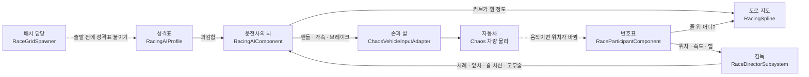
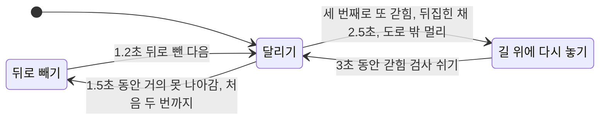

# 눈 없이 달리는 AI 운전사

레이싱 AI가 길을 따라가고, 다른 차를 알아채고, 막혔을 때 빠져나오는 방법을 쉬운 말로 풀었어요.
코드와 하나하나 대조해서 썼고, 숫자는 지금 성격표 에셋에 들어 있는 값이에요.
난이도나 코너 속도를 고치는 방법은 [AI_Difficulty.md](AI_Difficulty.md)에 따로 있어요.

---

## 한 줄로 말하면

AI 차에는 **눈이 없어요.** 카메라도, 레이더도, 앞으로 쏘아 보는 광선도 없어요.
대신 두 가지만 믿고 달려요.

- **도로 한가운데 그어 둔 보이지 않는 줄.** 사람이 레벨에 미리 깔아 둔 선이에요.
- **모든 차의 자리를 알고 있는 감독.** 누가 어디쯤 달리는지 감독이 알려 줘요.

그래서 AI는 벽을 "보고" 피하지 않아요. **줄에서 너무 멀어지지 않게** 달리니까 벽 근처에 갈 일이 없는 거예요.

---

## 누가 무슨 일을 하나요

운동회에 빗대면 쉬워요.

| 역할 | 하는 일 | 운동회로 치면 |
|---|---|---|
| 도로 지도 | 가운데 줄, 도로 폭, 커브가 얼마나 휘었는지, 결승선 위치를 갖고 있어요 | 운동장에 그은 트랙 선 |
| 번호표 | 모든 차에 붙어요. 플레이어 차에도요. "나는 줄의 어디쯤, 몇 바퀴째"를 기록해요 | 등에 붙인 번호표 |
| 감독 | 모든 번호표를 모아 순위를 매기고, AI마다 앞차 정보와 갈 차선을 알려 줘요 | 호루라기 부는 선생님 |
| 운전사의 뇌 | AI 차에만 있어요. 핸들을 얼마나 꺾고 페달을 얼마나 밟을지 정해요 | 달리는 학생의 머리 |
| 성격표 | 운전사가 얼마나 과감한지 적은 카드예요. Rookie, Advanced, Pro 세 장이 있어요 | 학년별 규칙 |
| 손과 발 | 뇌가 정한 숫자 세 개를 진짜 핸들과 페달로 바꿔요 | 손과 발 |
| 배치 담당 | 출발 전에 AI 차를 만들고, 성격표와 색을 붙이고, 줄을 세워요 | 출발선에 줄 세우는 선생님 |

감독은 AI에게 한꺼번에 말하지 않아요. **한 대씩 돌아가며** 생각할 차례를 줘요.
그래도 어느 차든 1초에 적어도 20번은 차례가 와요. 차가 늘어도 컴퓨터가 버벅이지 않게 하려는 거예요.

---

## 1. 길을 따라가는 법

### 내 자리는 숫자 두 개

차가 어디 있는지는 좌표 대신 **숫자 두 개**로 말해요.

- 출발선에서 줄을 따라 몇 미터 왔는지
- 줄에서 오른쪽이나 왼쪽으로 몇 미터 떨어졌는지

달리기 트랙에서 "3번 레인, 출발선에서 80미터"라고 말하는 것과 같아요.
도로 폭도 줄에서 양옆으로 몇 미터까지인지로 정해 둬요. 시험용 오벌은 양옆 7미터예요.

### 발밑이 아니라 저 앞 한 점을 봐요

자전거를 탈 때 바로 앞바퀴만 보면 비틀거리죠. 멀리 보면 똑바로 가요.
AI도 줄 위의 **저 앞 한 점**을 골라서 그쪽으로 핸들을 꺾어요.

- **얼마나 앞을 볼지는 속도에 따라 달라요.** Pro는 0.72초 뒤에 도착할 곳을 봐요. 시속 100 km면 20미터 앞이에요.
- **그 점은 언제나 도로 폭 안에서만 골라요.** 그래서 AI는 벽 쪽을 겨냥하지 않아요.
- **커브에서는 조심해요.** 너무 멀리 보면 그 점까지 곧게 그은 선이 커브 안쪽을 가로질러서, 안쪽 벽을 향해 버려요.
  그래서 커브에서는 줄을 따라 30도 넘게 돌아간 곳은 안 보고 더 가까운 점을 봐요.
- **핸들은 한 번에 휙 꺾지 않아요.** 옆에서 달리는 VR 플레이어 눈에 어색하지 않게 조금씩 돌려요.

### 커브 전에 미리 브레이크

계단 앞에서 뛰던 걸 멈추고 걷는 것처럼, AI도 커브가 오기 전에 미리 속도를 줄여요.

1. 앞길을 훑어보며 줄이 얼마나 급하게 휘는지 봐요. 지도에는 기본 2미터마다 "얼마나 휘었나"가 적혀 있어요.
2. 급한 커브일수록 천천히 지나가야 해요. 성격표의 과감함 숫자로 "이 커브는 몇 km로 갈 수 있다"를 계산해요.
3. 그 속도까지 줄이려면 지금부터 브레이크를 밟아야 하는지 거꾸로 따져요.
4. 앞으로 볼 수 있는 모든 커브 중에 가장 느리게 가야 하는 값을 지금 목표 속도로 정해요.

같은 반지름 50미터 커브를 성격표마다 이렇게 지나가요. 고무줄 보정은 뺀 값이에요.

| 성격표 | 커브 속도 |
|---|---|
| Rookie | 약 70 km/h |
| Advanced | 약 81 km/h |
| Pro | 약 92 km/h |

> **조심할 점.** 3번에서 "이 차는 브레이크를 이만큼 세게 밟을 수 있다"는 숫자를 성격표에서 가져와요.
> 진짜 차가 그만큼 못 서면 늦게 밟게 되고, 커브에 너무 빨리 들어가서 벽에 박아요.
> 예를 들어 Pro는 48미터 앞에서 밟기 시작하는데, 차가 실제로 0.9 G만 낸다면 70미터가 필요해요.
> 그러면 80 km/h로 들어가야 할 커브에 108 km/h로 들어가요.

---

## 2. 다른 차와 플레이어를 알아채는 법

### 눈 대신 감독의 순서표

AI는 다른 차도 보지 못해요. 감독이 모든 번호표를 모아서 알려 줘요.
"네 앞으로 줄을 따라 24미터에 차가 있어. 좌우로는 0.8미터 떨어졌어." 이런 식으로요.

광선을 쏘아서 부딪혀 보는 방식보다 훨씬 가볍고 정확해요. 참가하는 차가 몇 대뿐이라서 쓸 수 있는 방법이에요.

감독은 AI마다 앞차를 두 번 찾아 줘요.

| 찾는 차 | 범위 | 쓰는 곳 |
|---|---|---|
| 차선과 상관없이 가장 가까운 앞차 | 30미터 안 | 추월할지 정하기 |
| 내 차선에 있는 가장 가까운 앞차 | 좌우 2.4미터 안. 빠를수록 더 멀리까지 | 부딪히지 않게 속도 줄이기 |

바로 옆에 나란히 달리는 차는 앞차로 치지 않아요. 50센티미터 넘게 앞서야 앞차예요.

### 같은 차선이면 속도를 맞춰요

내 차선에 앞차가 있으면, 그 차 뒤에 일정한 간격을 두고 설 수 있을 만큼만 달려요.
Pro는 6미터, Advanced는 7.5미터, Rookie는 9미터 간격을 둬요.
앞차가 멈춰 있으면 그 간격에서 딱 멈추도록 계산해요.

그런데 추월하려는 중이면 아주 천천히라도 굴러가요. 멈춘 차는 옆으로 비킬 수 없으니까요.

### 앞차가 느리면 옆으로 비켜서 추월해요

- 앞차가 내가 원래 낼 속도보다 충분히 느리면 추월하기로 해요. Pro는 조금만 느려도, Rookie는 꽤 느려야 추월해요.
- 앞차가 도로 오른쪽에 있으면 왼쪽으로, 왼쪽에 있으면 오른쪽으로 비켜요.
- 두 AI가 같은 차를 추월하려 하면, **앞에 있는 AI가 먼저 쪽을 고르고** 뒤의 AI는 반대쪽으로 가요. 둘이 같은 쪽으로 몰려 부딪히지 않게요.
- 추월이 끝나면 레이싱 라인으로 돌아와요. 출발할 때 섰던 차선으로 돌아가는 게 아니에요.
  출발 직후에는 아직 차들이 붙어 있으니까 5초에 걸쳐 천천히 옮겨 가요.

### 플레이어에게는 더 넓게 비켜요

15미터 안의 앞차가 플레이어면 AI는 더 넓게 돌아가요. Pro는 1.2미터, Advanced는 1.6미터, Rookie는 2.2미터를 더 벌려요.
VR에서 옆으로 바짝 붙어 지나가면 경쟁이 아니라 멀미가 되거든요.

### 보이지 않는 고무줄

플레이어와 너무 멀어지면 보이지 않는 고무줄이 당겨요.

- 15미터 안에서는 아무 일도 없어요. 붙어서 겨루는 순간을 흔들지 않으려고요.
- AI가 앞서면 조금 느려지고, 뒤처지면 조금 빨라져요.
- 120미터 넘게 벌어지면 가장 세게 당겨요.

| 성격표 | 앞설 때 가장 많이 | 뒤처질 때 가장 많이 |
|---|---|---|
| Rookie | 23.8% 느려짐 | 15.3% 빨라짐 |
| Advanced | 12% 느려짐 | 9% 빨라짐 |
| Pro | 2.8% 느려짐 | 3.5% 빨라짐 |

---

## 3. 막혔을 때 빠져나오는 법

### 벽은 못 봐요

다시 말하지만 AI는 벽을 못 봐요. 줄 가까이 달리니까 평소에는 벽에 갈 일이 없을 뿐이에요.
그래도 다른 차에 밀리거나 커브에 너무 빨리 들어가면 벽에 붙을 수 있어요.

### 대신 "앞으로 안 가고 있네"를 알아차려요

속도계를 보지 않고, **줄을 따라 얼마나 나아가는지**를 봐요.
벽을 긁는 차는 바퀴가 돌고 속도계 숫자도 나오지만, 결승선에는 조금도 가까워지지 않거든요.

- 1초에 줄을 따라 60센티미터도 못 가는 상태가 1.5초 이어지면 "갇혔다"고 봐요.
- 출발하고 3초 동안은 이 검사를 안 해요. 막 출발한 차는 원래 느리니까요.

| 상황 | AI가 하는 일 |
|---|---|
| 처음 두 번 갇힘 | 1.2초 동안 핸들을 꺾으며 뒤로 빼요. 코를 길 쪽으로 돌리려고요 |
| 세 번째로 또 갇힘 | 지금 자리의 줄 위, 레이싱 라인에 번쩍 다시 놓아요 |
| 뒤집히거나 크게 기운 채 2.5초 | 바로 다시 놓아요 |
| 줄에서 도로 폭의 1.5배보다 멀어짐 | 바로 다시 놓아요 |
| 다시 놓은 직후 | 3초 동안 갇힘 검사를 쉬어요 |

앞으로 다시 잘 나아가면 갇힌 횟수는 0으로 돌아가요.

---

## 이 방식이 못 하는 것

- **줄이 틀리면 AI도 틀려요.** 줄이 도로 가운데에서 벗어나 있거나, 커브에 점이 너무 적어 실제보다 둥글게 휘면, AI는 그 틀린 줄을 믿고 달려요.
- **줄과 명단에 없는 건 몰라요.** 도로 위의 콘, 떨어진 물건, 번호표가 없는 차는 피하지 못해요.
- **커브 속도는 줄 기준이에요.** 추월하느라 안쪽에 가 있으면 실제로는 더 급하게 돌아야 해서 조금 빠르게 들어가요.
- **다른 차는 점으로 봐요.** 차의 길이나 모양은 모르고 "줄 위 어디쯤"만 알아요.

---

## 진짜 이름표

코드를 찾아볼 때 쓰세요. 경로는 `Plugins/RacingAI/Source/` 아래예요.

| 이 문서의 이름 | 코드 이름 | 파일 |
|---|---|---|
| 도로 지도 | `ARacingSpline` | `RacingAI/Public/RacingSpline.h` |
| 번호표 | `URaceParticipantComponent` | `RacingAI/Public/RaceParticipantComponent.h` |
| 감독 | `URaceDirectorSubsystem` | `RacingAI/Public/RaceDirectorSubsystem.h` |
| 운전사의 뇌 | `URacingAIComponent` | `RacingAI/Public/RacingAIComponent.h` |
| 성격표 | `URacingAIProfile` | `RacingAI/Public/RacingAIProfile.h`, 에셋은 `Content/Profiles/DA_Driver_*` |
| 손과 발 | `UChaosVehicleInputAdapter` | `RacingAIChaos/Public/ChaosVehicleInputAdapter.h` |
| 배치 담당 | `ARaceGridSpawner` | `RacingAI/Public/RaceGridSpawner.h` |
| 저 앞 한 점 보기 | `ComputeSteering` | `RacingAIComponent.cpp` |
| 커브 전에 미리 브레이크 | `GetTargetSpeedAtDistance`, `ComputeSpeedControl` | `RacingSpline.cpp`, `RacingAIComponent.cpp` |
| 내 자리 재기 | `RefreshProgress` | `RaceParticipantComponent.cpp` |
| 앞차 찾기 | `FindRacerAhead` | `RaceDirectorSubsystem.cpp` |
| 추월할 쪽 정하기 | `ArbitrateOvertaking` | `RaceDirectorSubsystem.cpp` |
| 고무줄 | `UpdateRubberBanding` | `RaceDirectorSubsystem.cpp` |
| 차례 돌리기 | `AdvanceAI` | `RaceDirectorSubsystem.cpp` |
| 갇힘 알아차리기와 다시 놓기 | `UpdateRecovery`, `RespawnOnTrack` | `RacingAIComponent.cpp` |
